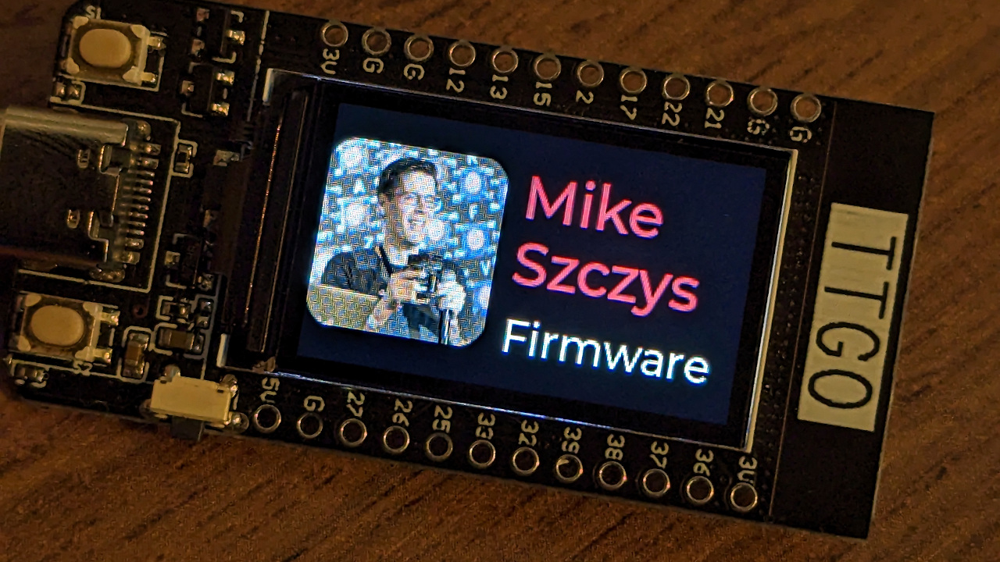

# Zephyr LVGL Demo using TTGO T-DISPLY (st7789)



This demo is based on the LVGL Basic Sample from the Zephyr tree.

Read the blog post:
[https://jumptuck.com/blog/2023-03-30-using-ttgo-t-display-with-zephyr/](https://jumptuck.com/blog/2023-03-30-using-ttgo-t-display-with-zephyr/)

# Build this project locally

```bash
# Install virtual environment
cd ~
mkdir zephyr-lvgld-ttgo-display
python -m venv zephyr-lvgld-ttgo-display/.venv
source zephyr-lvgld-ttgo-display/.venv/bin/activate
pip install wheel west

# Install this repository and all dependencies
cd ~/zephyr-lvgld-ttgo-display
west init -m git@github.com:szczys/zephyr-lvgld-ttgo-display.git .
west update
west zephyr-export
pip install -r deps/zephyr/scripts/requirements.txt

# Install Espressif binary blobs
west blobs fetch hal_espressif

# Build and flash
west build -b esp32 .
west flash
```
